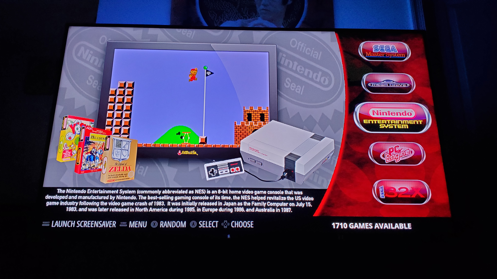
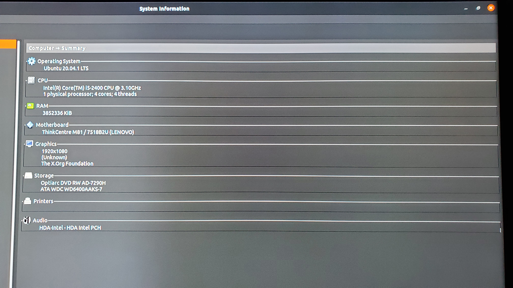
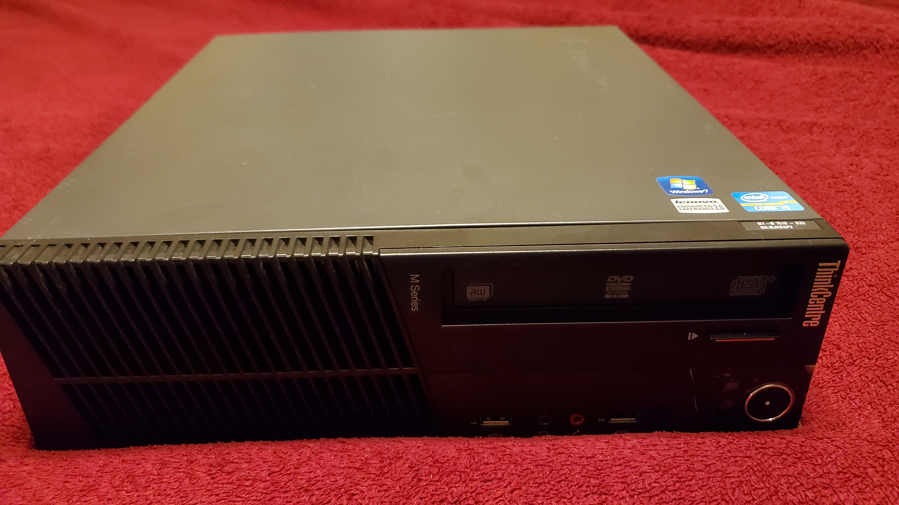
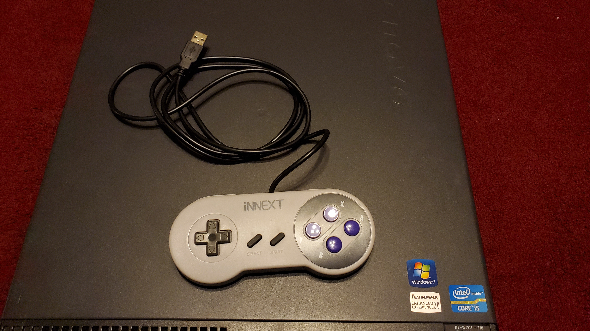
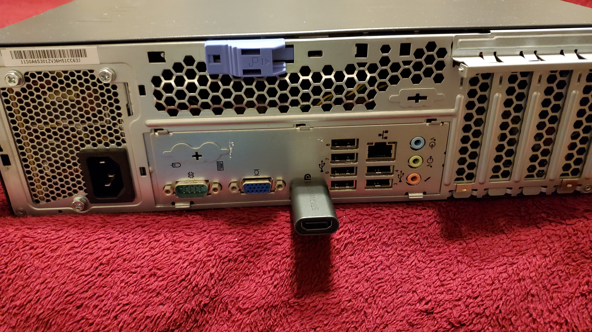
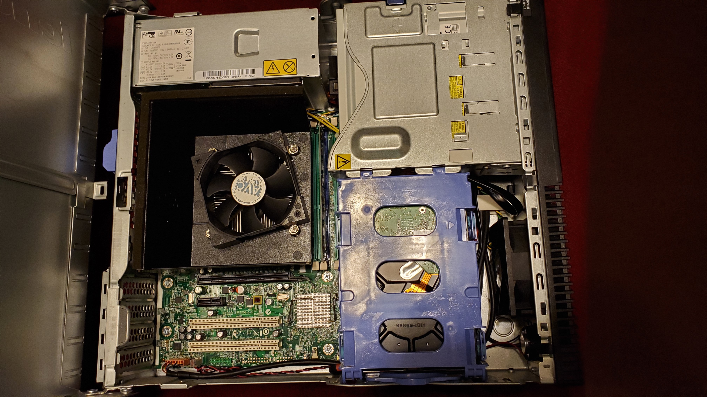

<link rel="stylesheet" type="text/css" href="video-embed.css">

 

# Intro
I've always had a love for old-school video games. The most cherished gaming memories I had as a child were from playing Galaga and Pac Man on my uncle's arcade cocktail cabinet. I was able to recapture this nostalgia using RetroPie on my Raspberry Pi 3 and loaded my favorite games on it. The Raspberry Pi is a very capable SOC given its size, but it does have it's limitations when it comes to emulating more recent systems like PlayStation, PSP, and GameCube. 

An old office PC would provide sufficient computing power to run games on those more demanding systems. Luckily, I was able to pick up a cheap Lenovo ThinkCentre PC from a local listing and got to work configuring RetroPie on it. This project post details my experience working with a Linux-based PC and navigating through the setup using the terminal.

# PC Specs
𝗖𝗣𝗨:  Intel Core i5-2400  
𝗥𝗔𝗠: 4 GB (1 x 4 GB) 
𝗛𝗗𝗗: 640 GB Western DigitalHard Drive Disk 
𝗢𝗦: Ubuntu 20.04.01 LTS  

#### Picture of the PC specs viewed in the Computer Summary*
 
#### The PC I used was a Lenovo ThinkCentre M81
 

#### I used a SNES style controller and a keyboard to configure the inputs for most of the systems. 
 

#### There was not HDMI output so I had to use a Displayport to HDMI adapter to connect it to my TV
 

#### There was no included storage when I picked up the PC, so I added a 640 GB Western Digital HDD as the boot drive and storage drive.
 

# Live Demo
Click on the YouTube video to see a live demo of the Retro Gaming System!



# Future Improvements

* 

