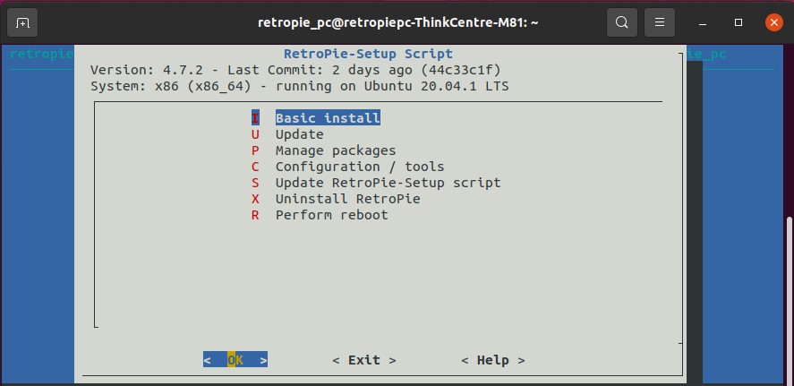
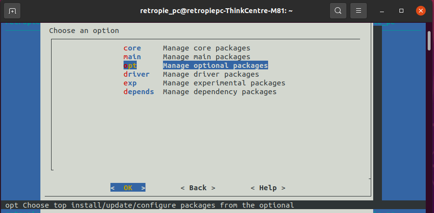
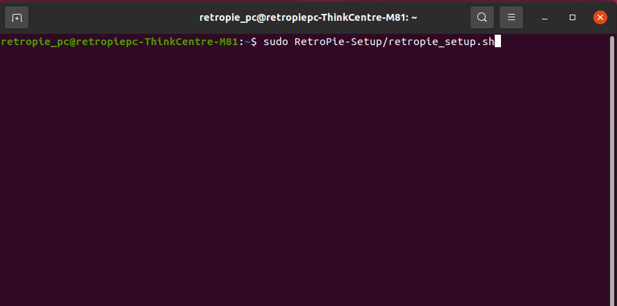
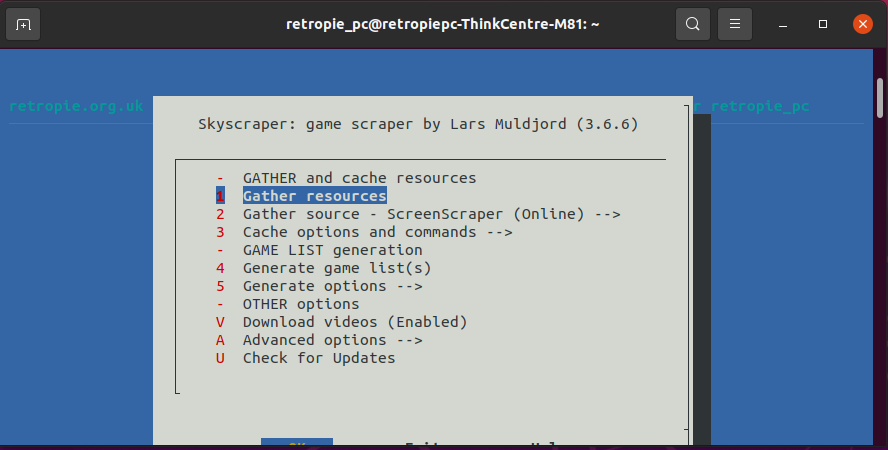
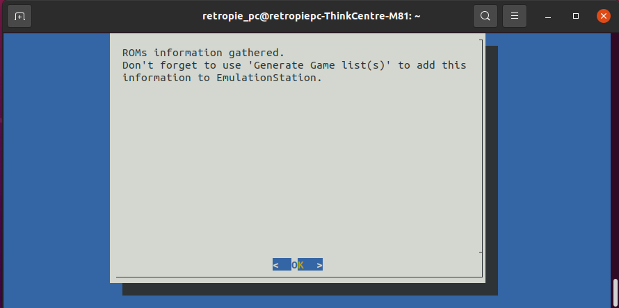
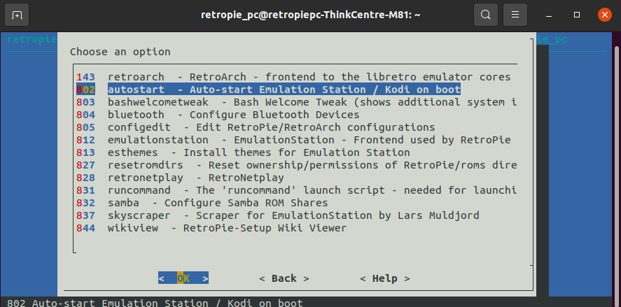

<link rel="stylesheet" type="text/css" href="video-embed.css">

<br>

# Intro
I've always had a love for old school video games. The most cherished gaming memories I had as a child were from playing Galaga and Pac Man on my uncle's arcade cocktail cabinet. I was able to recapture this nostalgia using RetroPie on my Raspberry Pi 3 where I loaded my favorite games on it. The Raspberry Pi is a very capable SOC given its size, but it does have its limitations when it comes to emulating more recent systems like PlayStation, PSP, and GameCube. 

An old office PC would provide sufficient computing power to run games on those more demanding systems. Luckily, I was able to pick up a cheap Lenovo ThinkCentre PC from a local listing and got to work configuring RetroPie on it. Although I have had experience setting up RetroPie on a Raspberry Pi, this is my first time installing it on an x86-based system. This project post details my experience working with a Linux-based PC and navigating through the setup using the terminal.

# PC Specs
𝗖𝗣𝗨:  Intel Core i5-2400 
𝗥𝗔𝗠: 4 GB (1 x 4 GB)
𝗛𝗗𝗗: 640 GB Western Digital Hard Drive Disk
𝗢𝗦: Ubuntu 20.04.01 LTS<br>

#### Picture of the PC specs viewed in the Computer Summary
<br>

#### The PC I used was a Lenovo ThinkCentre M81.
<br>

#### I used a SNES style controller and a keyboard to configure the inputs for most of the systems. 
<br>

#### There was no HDMI output so I had to use a DisplayPort to HDMI adapter to connect it to my TV.
<br>

#### No storage was included when I picked up the PC, so I added a 640 GB Western Digital HDD as the boot drive and storage drive.
<br>

# Initial Setup
I decided to use Ubuntu as the main OS as I wanted to experience a Linux desktop environment and the apparent 'snappiness' that a Linux distro offers instead of Windows. Given that the PC only had 4 GB of memory, It ran quite well without any stutters. My experience with 4 GB of memory on Windows has been less stellar as opening multiple browser tabs and applications would show noticable lag.  
After installing Ubuntu, I then installed RetroPie from the terminal using the following lines.

Update and upgrade the existing APT packages:

```
sudo apt update && sudo apt upgrade

```

Install the needed packages for the RetroPie setup script:

```
sudo apt install -y git dialog unzip xmlstarlet
```
Download the latest RetroPie setup script:

```
git clone --depth=1 https://github.com/RetroPie/RetroPie-Setup.git
```

I followed the documentation provided on the [RetroPie website](https://retropie.org.uk/docs/Debian/) to help download and setup the necessary files. 

# Configuration 
After installing the RetroPie setup script, I then navigated through the GUI to continue the installation procress. I performed a basic install and then rebooted the system.

<br>

Now, it was time to transfer the ROM files on my flash drive into the appropriate folders of the gaming systems that RetroPie had. Luckily, I had previously used Retropie on my Raspberry Pi, so all I had to do was copy and paste the ROM files into the corresponding gaming system folders.  

<br>

##### I forgot to screenshot the desktop environment, but it looked exactly the same as this picture with the only exception being the RetroPie shortcut and file directory installed. Credit to [Joey Sneddon @ omg!ubuntu!](https://www.omgubuntu.co.uk/2019/10/ubuntu-20-04-release-features) for the screenshot. 

I was able to configure my SNES style controller and map the correct inputs for the buttons. I loaded up Space Invaders on the Atari 2600 and everything seemed to be working as it should. However, some of the games were missing the box art and video previews for the games. The included scraper for EmulationStation only retrieves static box art as far as I know, so I had to use another scraper to get video previews. 

I decided to use Skyscraper by Lars Muldjord to retrieve the video previews which I downloaded from the optional packages in the Retropie Setup GUI. I followed this [video by ETA Prime](https://youtu.be/CF8BaAU-Wds) as a guide on how setup the scraper.

<br>

After Skycraper is finished downloading, a message will pop up and tell the user to quit EmulationStation and run RetroPie-Setup from the terminal. I typed in the following line to open Retro-Pie Setup using the terminal.

<br>

I then navigated back to Skyscraper and selected the "Gather resources" option. This will retrieve the video previews, box arts, and game information from an online database.  Due to the large amount of games I had, this process took about 3 hours for all the game data to be extracted. 

<br>

The final step after gathering resources is to generate the game lists. This process should be much quicker than the previous one as it only creates a game list in a XML file. 

<br>

And voila! After rebooting the system, a majority of the games had video previews and matching box art. There were a few that didn't have video previews or box art, so I used the default scraper to retrieve the remaining games. Check out the Live Demo to see it in action!

# Customization
The sky is the limit when it comes to customization and tailoring RetroPie. There's plenty of themes to choose from with a strong and talented community creating them on the daily. I opted to go for the Showcase theme as it allows video previews and was one of my personal favorites. 

##### I really like the clean layout and the description for each of the game systems is a nice touch. Credit to [dmmarti](https://retropie.org.uk/forum/topic/11723/new-theme-showcase-now-released)  for creating this theme and the screenshot. 

I also selected the autostart option so that the system will automatically boot to EmulationStation when it's powered on.

<br>
 
# Live Demo
Click on the YouTube video to see a live demo of the Retro Gaming System!



# Future Improvements

* Use SFTP (SSH File Transfer Protocol) to transfer ROMs and other files over the network instead of manually copying files from a USB stick
* Custom splash screen that greets the user when the unit boots up
* Test out more experimental packages such as PSCX2 (PlayStation 2 emulator)
